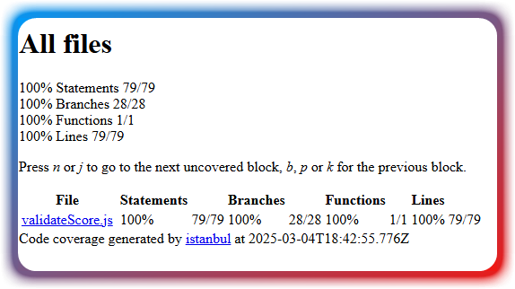
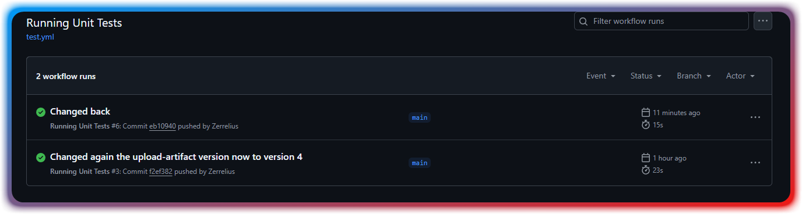

# Der Code Testing Workshop mit CI/CD

## Screenshots des Test-Coverage-Reports:



## Dokumentation von mindestens 3 entdeckten Fehlern doer Edge-Cases

```
test('edge case 11', () => {
        const result = validateScore('80');
        expect(result.valid).toBe(false);
        expect(result.errors).toContain('Score muss eine Zahl sein');
    });

    test('edge case 12', () => {
        const result = validateScore(80.5, { strictMode: true });
        expect(result.valid).toBe(false);
        expect(result.errors).toContain('Score muss eine ganze Zahl sein');
    });

    test('edge case 10', () => {
        const result = validateScore();
        expect(result.valid).toBe(false);
        expect(result.errors).toContain('Score ist erforderlich');
    });
```
Waren meine Edge Cases. Fehler wären als Beispiel Strings, Kommazahlen im Strict mode oder wenn man keine Zahl übergibt.

## Reflexion über Vor- und Nachteile des TDD-Ansatzes (Max. 150 Wörter)

Ich finde den TDD-Ansatz nur bedingt gut. Er gibt einem ein Schema vor nach dem man dann programmieren kann, doch zugleich finde ich das er einen massiv einschränkt. Immerhin könnte man auch auf einer alternative Lösung kommen und einen ganz anderen Ansatz im Code angehen, welcher durch den Fehlerfall am Ende nicht ausreichend abgedeckt wird.
Ich empfände es als besser wenn man die Unit Tests erst danach entwickelt.

## Screenshot der erfolgreichen GitHub Action

